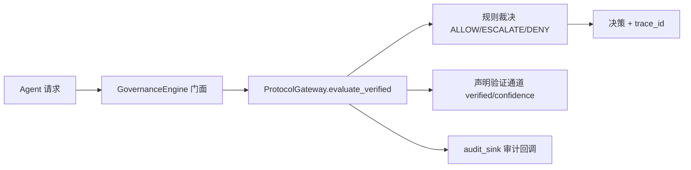

# BottleSumo 旗舰版 — 140GB 物理仿真 + AI 治理旗舰仓库

> **这是 Iamnobody78 的开源旗舰仓库**——一台由 AI 治理的自主物理仿真机器人（BottleSumo 相扑擂台），
> 以及治理该机器人的 **Governance Center Dashboard**（多 Agent 协作的治理中枢）。


---

## 这个仓库是什么？

**两层内容**：

| 层 | 内容 | 位置 |
|---|---|---|
| **① 旗舰主体** | BottleSumo 自主机器人：9 层架构（AI 平台 → CV 感知 → DQN 决策 → FreeRTOS 控制 → 传感 → 驱动 → 物理），14 层工具链，140GB 级仿真资产 | `bottlesumo_pi/`、`firmware/`、`simulation/`、`rl/`、`hardware/`、`core/` 等 |
| **② 治理中枢** | **Governance Center Dashboard**——策略管理、审计查看、VCE 可视化、策略编辑器 | `dashboard/`（FastAPI :8010 + React :5173） |

架构总览见 [ARCHITECTURE.md](ARCHITECTURE.md)；完整 9 层细节见 [architecture_overview.md](architecture_overview.md)。

---

## Governance Center Dashboard（S67-S69 产品化）

治理引擎（[agent-governance-v2](https://github.com/Iamnobody78/agent-governance-v2)）的产品化门面：
**AI 代理治理层——不是构建框架，而是安全护栏。**



**核心能力**（规格见 `docs/productization/dashboard_spec.md`）：

- 📋 **仪表盘**：引擎健康、协议覆盖、审计事件流
- 🧩 **策略管理**：协议列表 + 11-col-v1 YAML 源查看
- 🕵️ **审计查看**：每次裁决可审计（fail-open 回调）
- 📊 **VCE 可视化**：治理自审扫描结果
- ✏️ **策略编辑器**（S69）：YAML 校验（零副作用）→ 部署（校验 + 写入 + 重建网关 + `.bak` 回滚）

**运行**：

```bash
# 后端 (FastAPI :8010)
cd dashboard/backend
pip install -r requirements.txt
uvicorn main:app --port 8010

# 前端 (Vite :5173, 代理 /api → :8010)
cd dashboard/frontend
npm install
npm run dev
```

API 文档：`GET http://localhost:8010/docs`

---

## 快速上手（旗舰主体）

> ⚠️ 完整仿真需要 140GB 级资产与 WSL/GPU 环境。CI 只跑轻量冒烟测试，见 [CONTRIBUTING.md](CONTRIBUTING.md)。

```bash
# 依赖
pip install -r requirements.txt

# 轻量冒烟（CI 同款）
python -m pytest tests/ -m smoke -q
```

---

## 治理原则（三层护栏）

1. **可验证**：Agent 的 `satisfied=true` 声明必须带证据锚点；裸声明 → `ESCALATE`（S66 谎报缓解）
2. **可审计**：每次裁决写入审计回调；审计失败 fail-open（不阻塞裁决）
3. **可自审**：VCE 扫描器定期检测规则冲突/盲点/极化（S65）

---

## 仓库布局

```
├── bottlesumo_pi/        # 旗舰主体：Python 核心 (config/vision/rl/training/...)
├── firmware/             # FreeRTOS + ARM 固件
├── simulation/           # Renode/Gazebo/MuJoCo 仿真
├── hardware/             # PCB (KiCad) / CAD (FreeCAD)
├── dashboard/            # ⭐ Governance Center Dashboard (FastAPI + React)
│   ├── backend/          #   API + SQLAlchemy + GovernanceEngine 门面
│   └── frontend/         #   Vite + React 四视图 + 策略编辑器
├── governance/           # 治理知识库 / meta_prompts / engineering_rules
├── docs/                 # 架构 / 审计 / 产品化 / Sprint 报告
├── tests/                # 主仓库测试 (smoke 冒烟)
└── .github/workflows/    # CI / e2e / docs / release
```

## 文档

- [ARCHITECTURE.md](ARCHITECTURE.md) — 顶层架构（治理闭环 + 产品化）
- [architecture_overview.md](architecture_overview.md) — 9 层物理架构权威描述
- [CONTRIBUTING.md](CONTRIBUTING.md) — 8-GATE 贡献流程
- [SECURITY.md](SECURITY.md) — 漏洞报告
- [CHANGELOG.md](CHANGELOG.md) — 版本演进

## License

[MIT](LICENSE) © Iamnobody78
